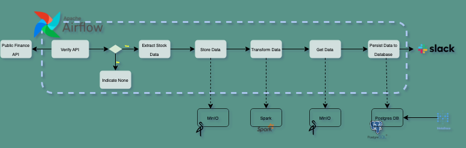
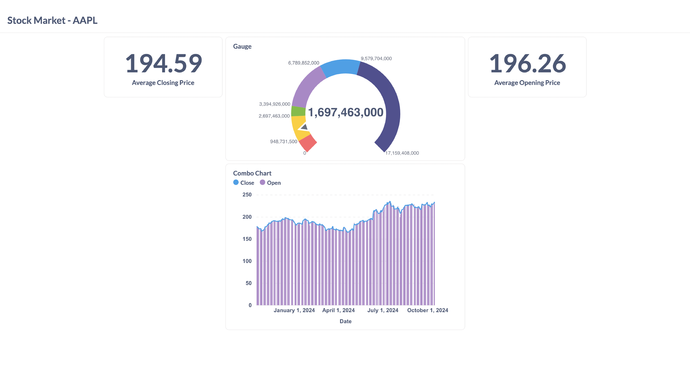

# Data Pipeline Orchestration

## Overview
This project demonstrates a data pipeline for orchestrating the ETL (Extract, Transform, Load) process using public finance data, Apache Spark, MinIO, PostgreSQL, Metabase, and Slack notifications.
### Set up
- Clone this repository by using this line of code:

        git clone https://github.com/Adeniyilowee/Data-Pipeline-Orchestration

- Open a terminal and change directory to the git cloned repository path:

        cd Data-Pipeline-Orchestration

- Intiate with the use of Astro:

        Astro dev start

- To trigger external container (Spark):

        cd spark/notebooks/stock-transform

- Build the container:

        docker build . -t airflow/stock-app

### Steps Involved:
1. **Extract Data**:
   Fetch financial data from a public **FINANCE API**.

2. **Load Data to MinIO**:
   Save raw data to **MinIO** (S3-compatible object storage) for initial staging.

3. **Transform Data with Apache Spark**:
   Use **Apache Spark** to process and transform the data, performing operations such as cleansing, aggregation, and format conversion. Store the transformed data back in MinIO.

4. **Store Data in PostgreSQL**:
   Load the transformed data from MinIO into a **PostgreSQL** database for structured storage.

5. **Visualize with Metabase**:
   Access the stored data using **Metabase** for interactive dashboards and reports.

6. **Slack Notifications**:
   Send a notification via **Slack** upon successful completion of each DAG run, ensuring real-time updates for pipeline monitoring.

---

### Requirements
- **Apache Spark**
- **Docker**
- **MinIO**
- **PostgreSQL**
- **Metabase**
- **Slack Webhook**
- **Apache Airflow (for DAG orchestration)**

### Pipeline Diagram

### Metabase Visualization

---

### Running the Pipeline
1. Set up the Apache Airflow using the connection_details.txt
2. Set up MinIO and PostgreSQL instances.
3. Connect Apache Spark with MinIO for data processing.
4. Configure Airflow to orchestrate DAG runs and trigger the Slack notifications.
5. Use Metabase to visualize and interact with the data stored in PostgreSQL.

---